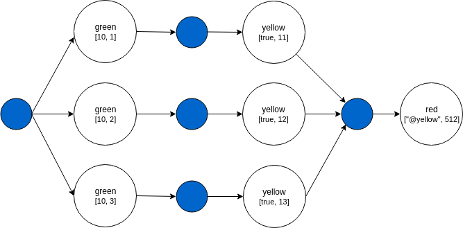
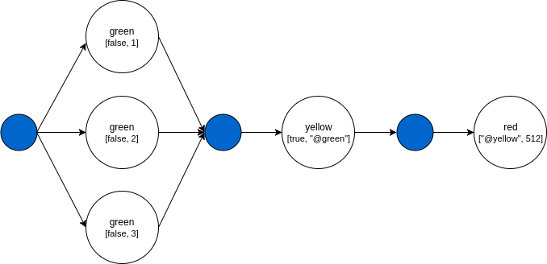
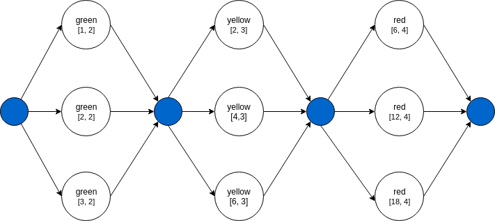
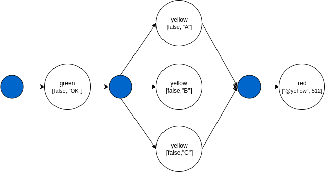
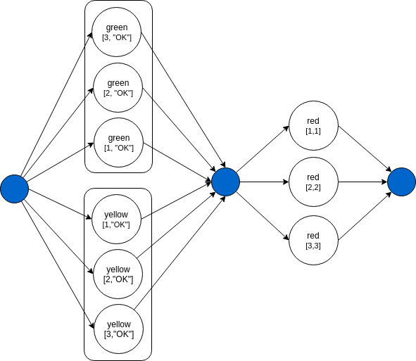

HKube allow special signs in the nodes input that designed to define the pipeline execution flow.

- (@)  - [Reference](#reference)
- (#)  - [Batch](#batch)
- (#@) - [Batch Reference](#batch-reference)
- (*@) - [Wait Any](#wait-any)

### Flow Input

You can define reusable data for nodes input, this input is an object that called **flowInput**.  
Using the @ sign we can easily refer to this object.

```json
"name": "example-flowInput",
"nodes": [{
    "nodeName": "example-node", 
    "algorithmName": "example-alg",
    "input": [42, true, "@flowInput.files.links", null, {"foo": "bar"}]
}],
"flowInput": {
    "files": {
        "links": [
            "links-1",
            "links-2",
            "links-3"
        ]}
}
```

Now the example algorithm will run with this input:

```json
example-alg: [42, true, ["links-1","links-2","links-3"], null, {"foo": "bar"}]
```

Or batch

```json
"name": "example-flowInput-batch",
"nodes": [{
    "nodeName": "example",
    "algorithmName": "example-alg",
    "input": [42, false, true, "#@flowInput.files.links", null, {"foo": "bar"}]
}],
"flowInput": {
    "files": {
        "links": [
            "links-1",
            "links-2",
            "links-3"
        ]}
}
```

And the algorithm will run three times with this input:

```json
example-alg 1: [42, true, ["links-1"], null, {"foo": "bar"}]
example-alg 2: [42, true, ["links-2"], null, {"foo": "bar"}]
example-alg 3: [42, true, ["links-3"], null, {"foo": "bar"}]
```

### Reference

As we can see in the A -> B -> C pipeline example, by using @ in the input  
we can take node output and make it the input of another node.

```json
"name": "reference",
"nodes": [{
    "nodeName": "green",
    "algorithmName": "green-alg",
    "input": [false, "OK"]
},
{
    "nodeName": "yellow",
    "algorithmName": "yellow-alg",
    "input": [true, "@green"]
},
{
    "nodeName": "red",
    "algorithmName": "red-alg",
    "input": ["@yellow", 512]
}]
```

The DAG of this pipeline will look like:  



The blue circle is the **pipeline driver** which responsible for executing nodes with the right order and the right input.  
Each result from any node is always return to the pipeline driver which decide what to do next.  

**Green node** will run first because it does not depend on any other node.  
Green node input will be: [false, "OK"].  

**Yellow node** depends on green node, see the "@green" in the input of the yellow node.  
So the input of the yellow node will be: [true, **green node output**].  
The last node to run will be the red node because it depend on the completion of the yellow node.  
The input of the red node will be: [**yellow node output**, 512].  

The final results of this pipeline will be the output of the red node.  
That because the red node is the last node in the pipeline.

### Batch

By using # in the input we can execute nodes in parallel and reduce the results into single node.   
This example is exactly like the first one, except the # sign in the input of the green node.

```json
"name": "batch",
"nodes": [{
    "nodeName": "green",
    "algorithmName": "green-alg",
    "input": [false, "#[1,2,3]"]
},
{
    "nodeName": "yellow",
    "algorithmName": "yellow-alg",
    "input": [true, "@green"]
},
{
    "nodeName": "red",
    "algorithmName": "red-alg",
    "input": ["@yellow", 512]
}]
```

The DAG of this pipeline will look like:  


The green node will run as a batch because of the # sign in the input.  
This pipeline will create three different tasks from type green-alg.  
each with a different input:  

```json
green-alg 1: [false, "1"]
green-alg 2: [false, "2"]
green-alg 3: [false, "3"]
```

The yellow node will wait until all tasks of the green node will finish.  
The input of the yellow node will be: [true, green node output].  
The input of the red node will be: [yellow node output, 512].

### Another Batch Example

```json
"name": "batch",
"nodes": [{
    "nodeName": "green",
    "algorithmName": "green-alg",
    "input": ["#[1,2,3]", 2]
},
{
    "nodeName": "yellow",
    "algorithmName": "yellow-alg",
    "input": ["#@green", 3]
},
{
    "nodeName": "red",
    "algorithmName": "red-alg",
    "input": ["#@yellow", 4]
}]
```

The DAG of this pipeline will look like:  
 


### Batch Reference

By using #@ in the input we can create a batch processing on node results.  
Lets say that green node returns an array: ['A', 'B', 'C'].

```json
"name": "batch-reference",
"nodes": [{
    "nodeName": "green",
    "algorithmName": "green-alg",
    "input": [false, "OK"]
},
{
    "nodeName": "yellow",
    "algorithmName": "yellow-alg",
    "input": [false, "#@green"]
},
{
    "nodeName": "red",
    "algorithmName": "red-alg",
    "input": ["@yellow", 512]
}]
```

**Node yellow** will run three times, each with a different input.

```json
yellow-alg 1: [false, "A"]
yellow-alg 2: [false, "B"]
yellow-alg 3: [false, "C"]
```

The DAG of this pipeline will look like:  


### Wait Any

By using *@ in the input we can create a wait any on batch.

```json
"name": "wait-any",
"nodes": [{
    "nodeName": "green",
    "algorithmName": "green-alg",
    "input": [10, "#[1,2,3]"]
},
{
    "nodeName": "yellow",
    "algorithmName": "yellow-alg",
    "input": [true, "*@green"]
},
{
    "nodeName": "red",
    "algorithmName": "red-alg",
    "input": ["@yellow", 512]
}]
```

The green node is defined to run as batch "#[1,2,3]".

```json
green-alg 1: [10, 1] -> 11
green-alg 2: [10, 2] -> 12
green-alg 3: [10, 3] -> 13
``` 

The first argument is 10 and the second is one number from the batch array.  
For each run it's return the sum of these two numbers.

Now what if we don't want that **Node yellow** will wait until all the batch processing is done?  
We can define in the node input to wait for any result of green, like this: "*@green".  
This way **Node yellow** will run three times, each with different input from **Node green** output.

```json
yellow-alg 1: [true, 11]
yellow-alg 2: [true, 12]
yellow-alg 3: [true, 13]
```

The DAG of this pipeline will look like:  
  

### Another Wait Any Example

What if we want to run multiple batches, and for each batch item result  
We want to run node that will accept results with same order they have been created.

```json
"name": "wait-any",
"nodes": [{
    "nodeName": "green",
    "algorithmName": "green-alg",
    "input": ["#[1,2,3]", "OK"]
},
{
    "nodeName": "yellow",
    "algorithmName": "yellow-alg",
    "input": ["#[1,2,3]", "OK"]
},
{
    "nodeName": "red",
    "algorithmName": "red-alg",
    "input": ["*@green", "*@yellow"]
}]
```

In this example the **Node red** will run with the correct tuples.
This is default behavior of the system.

```json
red-alg 1: [1, 1]
red-alg 2: [2, 2]
red-alg 3: [3, 3]
```

The DAG of this pipeline will look like:  
 

### Output
A user can define a pipeline's custom output structure and content.  
This output may contain output from nodes which are not leafs and have child nodes, it may contain a sub set of a pipelines default output.  
To define such output a node of kind "output" is added to the pipeline. This node output is equal to its input, what ever is defined in the output node input attribute will be in the algorithm result.  
#### limitations
-  An output node can not have an empty input attribute.
-  An output node can not have other nodes depend on him, it must me the pipelines last node.