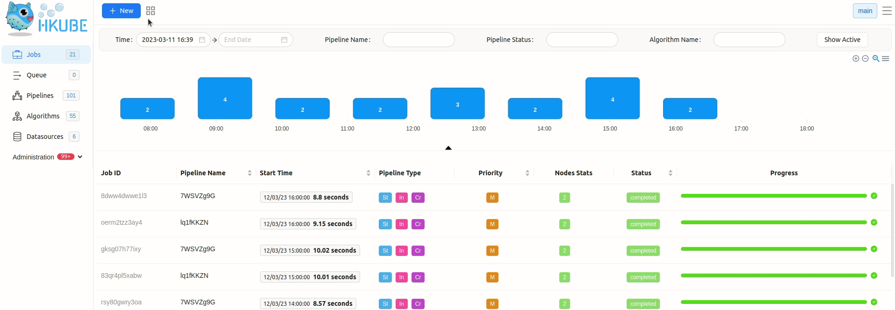
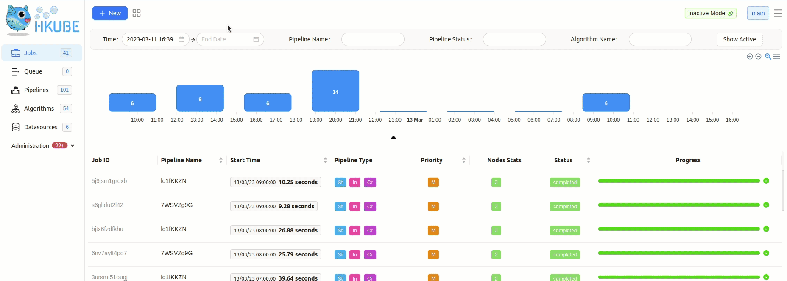
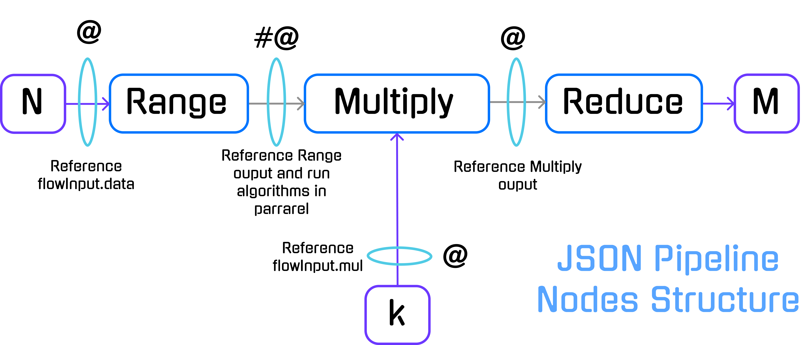
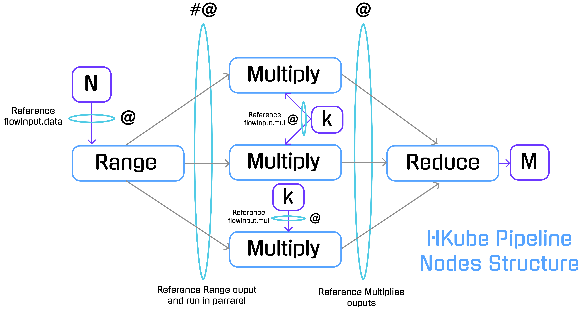

> HKube is a cloud-native open source framework to run **[distributed](https://en.wikipedia.org/wiki/Distributed_computing) pipeline of algorithms** built on [Kubernetes](https://kubernetes.io/).
>
> HKube optimally **utilizing** pipeline's resources, based on **user priorities** and **[heuristics](https://en.wikipedia.org/wiki/Heuristic)**.

## Features

- **Distributed pipeline of algorithms**

  - Receives [DAG graph](https://en.wikipedia.org/wiki/Directed_acyclic_graph) as input and automatically parallelizes your algorithms over the cluster.
  - Manages the complications of distributed processing, keep your code simple (even single threaded).

- **Language Agnostic** - As a container based framework designed to facilitate the use of any language for your algorithm.

- **Batch Algorithms** - Run algorithms as a batch - instances of the same algorithm in order to accelerate the running time.

- **Optimize Hardware Utilization**

  - Containers **automatically** placed based on their resource requirements and other constraints, while not sacrificing availability.
  - Mixes critical and best-effort workloads in order to **drive up utilization** and save resources.
  - **Efficient execution** and clustering by heuristics which uses pipeline and algorithm metrics with combination of user requirements.

- **Build API** - Just upload your code, you **don't have to worry** about building containers and integrating them with HKube API.


## Getting started
- HKube has UI, [CLI](../learn/api/#Cli) and [RESTFUL-API](../learn/api/#restful-api).
- **Prerequisite** - See [Install](../learn/install/) for both **local** and **production** environments

- **Creating your first Algorithm**

  - Currently, we support Javascript, Python and Java **autobuild**.
  - Your algorithm gets it's inputs from Hkube the following way:

  >Java example - see [Documentation](https://raw.githubusercontent.com/kube-HPC/java-wrapper.hkube/master/algorithm-example/src/main/resources/instructions.txt)
  
  >Python example

    ```Python
    def start(args):
        print('algorithm: range start')
        input = args['input'][0]
        array = list(range(input))
        return array
    ```
  >Javascript example

    ```Javascript
    module.exports.start = args => {
        console.log('algorithm: reduce start');
        const input = args.input[0];
        return input.reduce((acc, cur) => acc + cur);
    };
    ```
  - There are three ways to deploy your algorithms:
     
    - HKube can build your docker automatically via a **Package** or a **Repository** - github/gitlab.
    - Via a pre-built docker image - 
      > In order to add algorithm manually to HKube, you need to wrap your algorithm with HKube. HKube already has a wrappers for `python`,`javaScript`, and `java`.
    - Via a packaged file - You must pack your algorithm using
    ```Console
    $ tar -zcvf MyAlgo.tar.gz *
    ```
    >To further elaborate, the "Packaged file" option requires a package containing all of the necessary files for the project to work, with your algorithms name serving as the "Entry point" in the wizard.
    You may package all of your algorithms in one package, and choose different algorithm files as different "Entry Points", or choose to package each algorithm separately.
    
    
  - The pipeline is built from algorithms which are containerized with docker :

    
- **Creating a Pipeline**
    
    - While being able to run the uploaded algorithms seperately, you may create a pipeline to build your algorithm flow.
    - Using the pipeline creation wizard, you may interconnect existing algorithms and modify the input flow between each part.

  
  
- **Running your creations**

    - Both algorithms and pipelines, produce results and logs that can be viewed in the UI.
    - We offer debugging options and various advanced configurations.

>For  detailed CLI Example, refer to [Step-by-step](#step-by-step-cli-example) 


## Let's talk about HKUBE
Here, we will present a specific example to showcase the abilities of HKube.
### The Problem

We want to solve the next problem with given input and a desired output:

- _Input:_ Two numbers `N`, `k`.
- _Desired Output:_ A number `M` so: 

For example: `N=5`, `k=2` will result:

### Solution

We will solve **the problem** by running a distributed pipeline of three algorithms: Range, Multiply and Reduce.

#### Range Algorithm

-Receives a parameter `N` and returns an array of length N with ascending values 

-In our pipeline, this will serve as the Entry point
```console
 N = 5
 5 -> [1,2,3,4,5]
```
[Range](https://github.com/kube-HPC/examples/tree/master/autobuild-examples/range-algo-python) - code example
#### Multiply Algorithm
-Receives parameter `k` and value `I` , and returns their multiplication result.

-In our pipeline, the value `I` will be received from `Range Algorithm` and multiplied by `k`.

The `Multiply` algorithm will be invoked parallelly for each Input received from the previous node (`Range`).

```console
k = 2 , I = 4
(4) * (2) -> (8)
```
[Mult](https://github.com/kube-HPC/examples/tree/master/autobuild-examples/mult-algo-python) - code example
#### Reduce Algorithm

-The algorithm will return the sum of the received array

-In our pipeline, the algorithm waits to receive all of the results from the `Multiply` algorithm.

```console
[2,4,6,8,10] -> 30
```
[Sum](https://github.com/kube-HPC/examples/tree/master/autobuild-examples/sum-alg-nodejs) - code example
## Implementing the Algorithms

We will create the algorithms to solve [the problem](#the-problem), HKube currently support two languages for auto build _Python_ and _JavaScript_.

>Examples of the following algorithms are available [here](https://github.com/kube-HPC/examples/tree/adding-examples-for-101/autobuild-examples).

>Further elaboration on the various ways to implement the [algorithms](../learn/algorithms/) is present.

##### Range (Python)

```Python
def start(args):
    print('algorithm: range start')
    input = args['input'][0]
    array = list(range(input))
    return array
```

The `start` method calls with the args parameter, the inputs to the algorithm will appear in the `input` property.

The `input` property is an array, so you would like to take the first argument (`"input":["@flowInput.data"]` as you can see we placed `data` as the first argument)

##### Multiply (Python)

```Python
def start(args):
    print('algorithm: multiply start')
    input = args['input'][0]
    mul = args['input'][1]
    return input * mul
```

We've sent two parameters `"input":["#@Range","@flowInput.mul"]`, the first one is the output from `Range` that sent an array of numbers, but because we used the **batch** sign **(#)** each instance of the multiply algorithm will get one item from the array, the second parameter we passing is the `mul` parameter from the `flowInput` object.

##### Reduce (Javascript)

```javascript
module.exports.start = args => {
	console.log('algorithm: reduce start');
	const input = args.input[0];
	return input.reduce((acc, cur) => acc + cur);
};
```

We've placed `["@Multiply"]` in the input parameter, HKube will collect all the data from the multiply algorithm and will send it as an array in the first input parameter.

## Step-by-step CLI Example

- **CLI Prerequisite** - See [CLI-Installation](../learn/installCLI/)


### Integrate Algorithms

After we've created the [algorithms](#implementing-the-algorithms), we will integrate them with the CLI.
For the packaged tar files, see [Repo](https://github.com/kube-HPC/examples/tree/adding-examples-for-101/autobuild-examples) tar files for **each** of the algorithms.

Create a `yaml` (or `JSON`) that defines the **algorithm**:

```yaml
# range.yml
name: range
env: python # can be python or javascript
resources:
  cpu: 0.5
  gpu: 1 # if not needed just remove it from the file
  mem: 512Mi

code:
  path: /path-to-algorithm/range.tar.gz
  entryPoint: main.py
```
>All of the needed tar files for this example reside [Here](https://github.com/kube-HPC/examples/tree/master/autobuild-examples/tar-packages)

Add it with the CLI:

```console
hkubectl algorithm apply --f range.yml
```

> This step must be performed **for each of the algorithms**.

### Building a Pipeline

The algorithms from the previous step are used to **construct a pipeline** using **HKube**.


#### Pipeline Descriptor

The **pipeline descriptor** is a **JSON object** which describes and defines the links between the **nodes** by defining the dependencies between them.

```json
{
	"name": "numbers",
	"nodes": [
		{
			"nodeName": "Range",
			"algorithmName": "range",
			"input": ["@flowInput.data"]
		},
		{
			"nodeName": "Multiply",
			"algorithmName": "multiply",
			"input": ["#@Range", "@flowInput.mul"]
		},
		{
			"nodeName": "Reduce",
			"algorithmName": "reduce",
			"input": ["@Multiply"]
		}
	],
	"flowInput": {
		"data": 5,
		"mul": 2
	}
}
```

> Note the `flowInput`: `data` = N = 5, `mul` = k = 2

For more pipeline descriptor options, see [Advanced](../learn/advancedPipeline/)

#### Node dependencies - Legend

HKube allows special [signs](http://hkube.io/learn/execution/#batch) in node `input` for defining the pipeline execution flow.

In our case we used:

**(@)**  —  References input parameters for the algorithm.

**(#)**  —  Execute nodes in parallel and reduce the results into single node.

**(\#@)** — By combining `#` and `@` we can create a batch processing on node results.



#### JSON Breakdown

We created a pipeline name `numbers`.

```json
    "name":"numbers"
```

The pipeline is defined by three nodes.

```json
"nodes":[
    {
            "nodeName":"Range",
            "algorithmName":"range",
            "input":["@flowInput.data"]
        },
        {
            "nodeName":"Multiply",
            "algorithmName":"multiply",
            "input":["#@Range","@flowInput.mul"]
        },
        {
            "nodeName":"Reduce",
            "algorithmName":"reduce",
            "input":["@Multiply"]
        },
    ]
```

In HKube, the linkage between the nodes is done by defining the algorithm inputs. `Multiply` will be run after `Range` algorithm because of the input dependency between them.

Keep in mind that HKube will transport the results between the nodes **automatically** for doing it HKube currently support two different types of transportation layers _object storage_ and _files system_.



The `flowInput` is the place to define the Pipeline inputs:

```json
"flowInput":{
    "data":5,
    "mul":2
}
```

In our case we used _Numeric Type_ but it can be any [JSON type](https://json-schema.org/understanding-json-schema/reference/type.html) (`Object`, `String` etc).


### Integrate Pipeline

Create a `yaml` (or `JSON`) that defines the **pipeline**:

```yml
# number.yml
name: numbers
nodes:
  - nodeName: Range
    algorithmName: range
    input:
      - '@flowInput.data'
  - nodeName: Multiply
    algorithmName: multiply
    input:
      - '#@Range'
      - '@flowInput.mul'
  - nodeName: Reduce
    algorithmName: reduce
    input:
      - '@Multiply'
flowInput:
  data: 5
  mul: 2
```

#### Raw - Ad-hoc pipeline running

In order to run the pipeline as raw-data:

```bash
hkubectl exec raw --f numbers.yml
```

#### Stored - Storing the pipeline descriptor for future runs

First we store the pipeline:

```bash
hkubectl pipeline store --f numbers.yml
```

Then you can execute it (if `flowInput` available)

```bash
# flowInput stored
hkubectl exec stored numbers
```

For executing the pipeline with other input, create `yaml` (or `JSON`) file with `flowInput` key:

```yml
# otherFlowInput.yml
flowInput:
  data: 500
  mul: 200
```

Then you can execute it by the pipeline `name` property:

```bash
# Executes pipeline "numbers" with data=500, mul=200
hkubectl exec stored numbers --f otherFlowInput.yml
```

### Monitor Pipeline Results

As a result of executing pipeline, HKube will return a `jobId`.

```bash
# Job ID returned after execution.
result:
  jobId: numbers:a56c97cb-5d62-4990-817c-04a8b0448b7c.numbers
```

This is a unique identifier enables **query** on the **specific pipeline execution**.

- **Stop** pipeline execution:
  `hkubectl exec stop <jobId> [reason]`

- **Track** pipeline status:
  `hkubectl exec status <jobId>`

- **Track** pipeline result:
  `hkubectl exec result <jobId>`