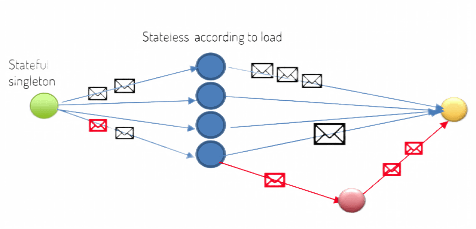
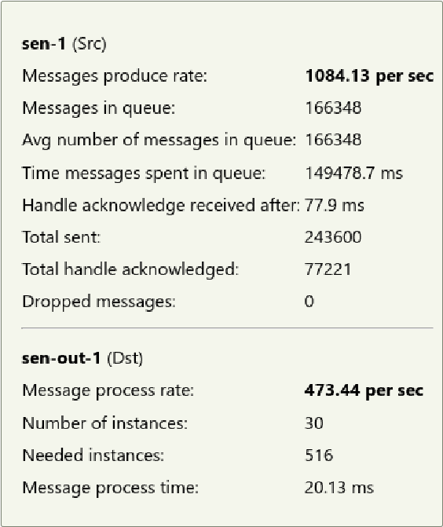
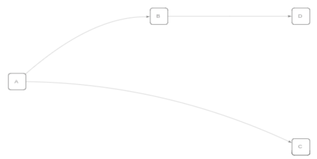
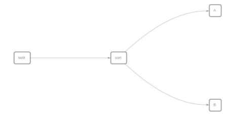

## Introduction
While Batch processing is need for some cases, such as gathering and data enrichment, there are other cases where the data is generated continuously, which typically send in the data records simultaneously. Streaming data includes a wide variety of data such as log files generated by customers using your mobile or web applications, eCommerce purchases, in-game player activity, information from social networks, financial trading floors, or geospatial services telemetry from connected devices or instrumentation in data centers.  
HKube's data streaming is an extension to HKube batch processing pipeline architecture that handles millions of events at scale,
In real-time. As a result, you can collect, analyze, and store large amounts of information.
That capability allows for applications, analytics, and reporting in real-time.



### Use Cases - Stream Tweets in real-time
So where are HKube data streams good for? Let's take a look at a stream from Twitter as an example. In this particular case, we want to enrich the data from other resources, such as Facebook, LinkedIn, and other internal databases before saving it.
The process is as follows:

- Stream Tweets in Real-Time: Use the Twitter API and HKube Streaming to get and analyze real-time tweets for your research.
- twitt node: The "twitt" node subscribes to the Twitter API and receives real-time tweets.
- sort node: The "sort" node sorts the tweets based on their language and routes them accordingly.
- Nodes "A" and "B" analyze the tweet messages and save them to the database.

### Creating a Pipeline Stream
To create a stream, you will have to create a new pipeline.
To make life easier, HKube offers an easy wizard to create a pipeline. There is also an option to enter json file text editor.
In the wizard, you have 3 steps:

- Initial: Here you must set a name, and select the Pipeline Kind to be Streaming.
- Nodes: Here you set your nodes kind (stateless, stateful, gateway), names and their algorithms. Algorithms must be pre-uploaded to HKube [(how to upload)](../#getting-started).
- Options: Here you can set your Streaming Flows. First you need to give it a name, afterward enter the syntax (manually or by wizard). More information about how stream flow syntax works will be explained in detail later.


## Features
HKube streaming pipeline supports:

### Unique data transportation
HKube has its own data transportation system, enabling direct data transfer between nodes in a manner that ensures the following

- The data will maintain its order.
- High throughput with low latency.
- High scalability.

***

### Autoscaling
The throughput of streaming can vary over time, allowing us to handle bursts and free up resources for other jobs when they are not needed.
With its own unique heuristic system, HKube is able to recognize changes in throughput and act quickly to support these needs.
To better understand this, let's look at a scenario that demonstrates how HKube handles pressure.

#### Scaling Range
Autoscaling is used by each node by adjusting the number of pods it uses within the specified min-max range.
By using autoscaling, we shut down unnecessary pods to maintain efficiency.
HKube allows to adjust the minimum and maximum number of pods for stateless node:

**Minimum:**

- Defines the minimum number of pods for a stateless node.
- The number of running pods can't be lower than the pre-defined minimum.
- When the application starts, the stateless node will initialize at application up-time, which may be more time-efficient.
- This setting it essential when the resource is needed at up-time.

**Maximum:**

- Defines the maximum number of pods for a stateless node.
- The number of running pods can't be higher than the pre-defined maximum.
- It can be toggled off, in which case the system has no maximum limit.
- This setting is essential when it's necessary to limit the given resources.

***

### Edge Statistics
HKube shows detailed statistics on the flow between a pair of nodes, which can be used to analyze the relationships between them.
To view the statistics, place your cursor over the flow between the nodes.
By using the statistics, you can obtain data about the requests and responses, as follows:

- **currentSize:** The number of pods running the algorithm.
- **reqRate:** The rate of messages arriving to queue, calculated as (Δ message count) / (Δ time in seconds).
- **resRate:** The rate of messages leaving the queue, calculated as (Δ message count) / (Δ time in seconds).
- **queueSize:** Number of messages in the queue at any given time.
- **avgQueueSize:** The average number of requests in the queue.
- **processingTimeMs:** Time spent in the onMessage() method in your code. || The average processing time in milliseconds for all requests.
- **roundTripTimeMs:** The average round trip time in milliseconds for all requests (trip is the total time from when a request is created to when it is successfully handled).
- **queueTimeMs:**  Time messages spent in the queue, calculated as a mean on all messages waiting times in a given time. || The average time requests spend in the queue.
- **durationRate:** The average of all positive durations, where duration is the amount of time it took to handle a request.
- **grossDurationRate:** 
- **throughput:** Request rate / response rate as a percentage. For example, if you see 700%, it means the ratio between requests and responses is 7 to 1.
- **totalRequests:** The total number of requests sent.
- **totalResponses:** The total number of responses sent (handled requests).
- **totalDropped:** The total number of requests that did not receive a response.

The following are additional statistics that are specifically relevant to stateless algorithms:

- **required:** The number of pods required, according to the load.
- **desired:** The number of pods desired.
- **status:** The status of the node.



***

### Conditional Data Flows:
In streaming data, most of the time, we expect the data to follow a specific flow. However, there are scenarios where we need to dynamically change this flow. To illustrate, let's consider the Twitter use case: typically, we aim to enrich the data with additional information from other resources. However, there may be instances where we are unable to identify the author of a post. In such cases, we need to establish additional prerequisites before proceeding with the enrichment. HKube assists in handling such situations with conditional data flow. We will explain how to create and work with this feature later.

***

### How to Work with Streaming Pipelines
Streaming pipelines are built from Stateful and Stateless algorithms.

#### Stateful Algorithm:
- A stateful algorithm is tailored for a specific execution.
- The stateful algorithm must use HKube's SDK to decide on which flow the data should continue: the default one or one of the conditionals.
- Only one stateful algorithm can be executed for each algorithm kind in a specific execution.
- There can be multiple stateful algorithms with different node names.
- The stateful algorithm will be closed if one of the following occurs:
	- The execution is terminated by the client using HKube's API.
	- The main function of the algorithm returns.

#### Stateless Algorithm:
- A stateless algorithm can serve multiple executions throughout its life.
- The stateless algorithm can dynamically scale (up/down) according to the job’s needs.
- Upon failure, HKube will skip the current execution for performance reasons.
- The stateless algorithm doesn't need to use HKube's API to continue the flow; this happens after the return command.
- Scaling up stateless algorithm depends on:
	- The sending node's queue size.
	- The rate of increase/decrease in queue size.
	- The processing time of the receiving node.

#### Streaming Flow:
- The flow represents the movement of data through the pipeline nodes. It must start with a Stateful Node/Algorithm.
- You can define more than one flow in every pipeline, and each flow has its unique name.
- Streaming flows are defined using a simple syntax: >> is used for defining a streaming node flow, & for "and," and | for different streaming flows. Examples:
    - Flow named "flow1" streams from node A to nodes B and C, and node B streams to node D. Syntax: A >> B&C | B >> D.

    ```json
{
    "streaming": {
        "flows": {
            "flow1": "A >> B&C | B >> D",
        },
        "defaultFlow": "master"
    }
}
```


    - Flow named "analyze" streams from node "sort" to node A. Syntax: sort >> A.
    Also, flow named "master" streams from node "twitt" to node "sort," which then streams to node B. Syntax: twitt >> sort >> B.
```json
{
    "streaming": {
        "flows": {
            "analyze": "sort>>A",
            "master": "twitt >>sort>>B"
        },
        "defaultFlow": "master"
    }
}
```


### Advanced

#### HKUBE API STREAMING METHODS for Stateful Algorithm

- **sendMessage(msg, flowName)**
    - This method passes on a message to the next node in the pipeline flow.
    - Parameters:
        - msg: A created message as desired to be obtained by the next node.
        - flowName: The name of the flow of nodes defined in the pipeline definition. This parameter should be given only if a new flow is initiated (not if the processing is already in the middle of a flow). If no flow name is given and the node is not in the middle of a flow initiated earlier, the default flow defined in the pipeline definition will be used as a flow name.
- **registerInputListener(onMessage=handleMessage)**
    - This method is used only within a stateful algorithm. It allows registering a method written by the algorithm implementor, which will be invoked upon each message that arrives.
    - The onMessage signature is onMessage(msg, origin), where the origin is the name of the previous node.

- **startMessageListening()**
    - This method is used only within a stateful algorithm. Once all message handlers have been registered using registerInputListener, startMessageListening needs to be invoked to start receiving messages upon arrival.