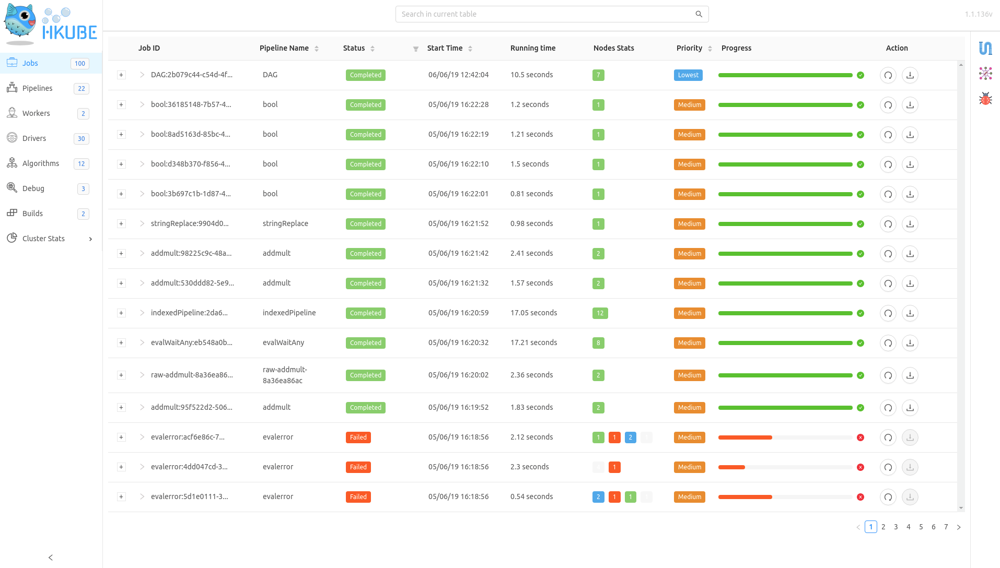
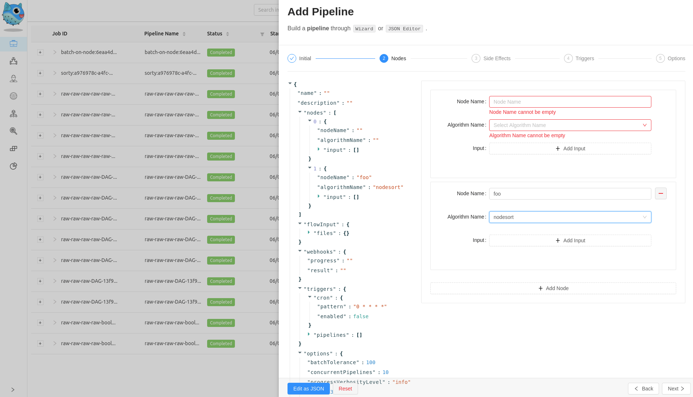
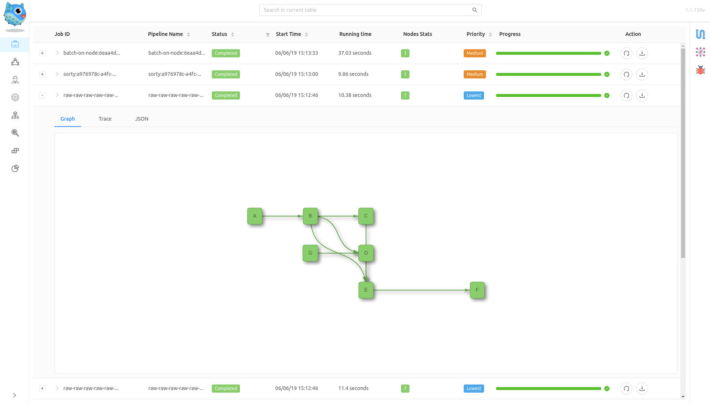

- [Overview](#overview)
  - [Accessing the Dashboard UI](#accessing-the-dashboard-ui)
  - [Features](#features)
    - [Operations](#operations)
    - [Tables](#tables)

## Overview

> Dashboard is a web-based [HKube](https://github.com/kube-HPC/hkube) user interface.

Dashboard is an implementation of **Hkube Restful API**.

> Check Full Rest API [documentation](http://hkube.org/spec), and
> [Swagger-UI](http://petstore.swagger.io/?url=https://raw.githubusercontent.com/kube-HPC/hkube/master/core/api-server/api/rest-api/swagger.json).

Use Dashboard for **deploying** and **monitoring** user
[algorithms](http://hkube.org/learn/algorithms/)
and [pipelines](http://hkube.org/learn/pipelines/).

### Accessing the Dashboard UI

- `https://<KUBERNETES-MASTER-IP>/hkube/simulator/`

### Features

The Dashboard follows two main concepts **Operations** and **Tables**.

#### Operations

Actions which deploying data to HKube.
Use Operations sidebar for adding `pipelines`, `algorithms` etc.

#### Tables

View Tables for monitoring HKube data.
Navigate Tables panel for viewing information about `pipelines` structures, `algorithm` info etc.

